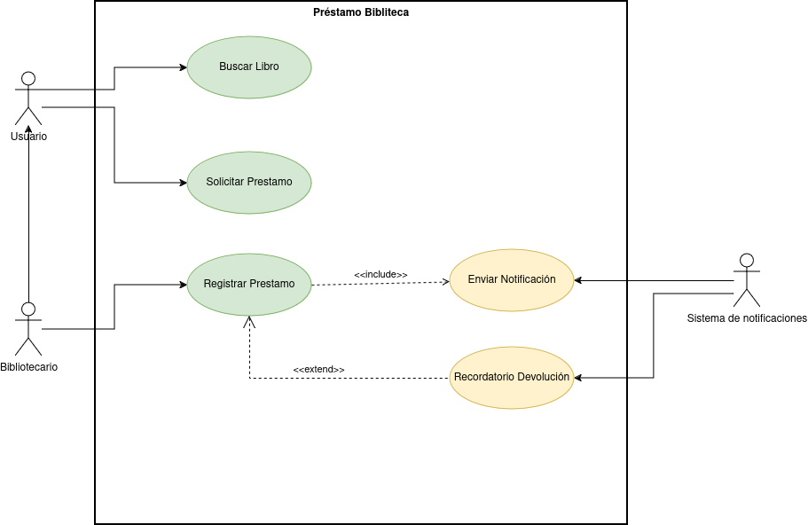

# Proyecto Biblioteca

## Diagrama de Casos de Uso de la biblioteca

## Especificacion de  casos de uso de la bibloteca

### Actores

#### Usuario

|  Actor | Usuario |
|---|---|
| Descripción  | Usuario común de la bliblioteca |
| Características  | |
| Relaciones | Registrar un prestamo |
| Referencias | Buscar libro, Solicitar prestamo|   
|  Notas | |
| Autor  | Nicolás Expósito Hernández|
|Fecha | 29/10/2024 |

#### Bibliotecario

|  Atributo |||
|---|---|---|
| _Nombre_  | _Descripción_  | _Tipo_ |
| | |

|  Actor | Bibilotecario |
|---|---|
| Descripción  | Bibilotecario de la bliblioteca |
| Características  | El biblotecario puede realizar las mismas acciones que el usario y las relaciones especificas |
| Relaciones | Registrar un prestamo |
| Referencias | Buscar libro, Solicitar prestamo, Registrar un prestamo|   
|  Notas | |
| Autor  | Nicolás Expósito Hernández|
|Fecha | 29/10/2024 |

|  Atributo |||
|---|---|---|
| _Nombre_  | _Descripción_  | _Tipo_ |
| | |

#### Sistema de notificaciones

|  Actor | Sistema de notificaciones |
|---|---|
| Descripción  | Sistema de notificaciones de la bliblioteca |
| Características  | |
| Relaciones ||
| Referencias | Enviar Notificacion, Recordatorio De Devolución|   
|  Notas | |
| Autor  | Nicolás Expósito Hernández|
|Fecha | 29/10/2024 |

|  Atributo |||
|---|---|---|
| _Nombre_  | _Descripción_  | _Tipo_ |
| | |

### Casos de uso

### Buscar libro

|  Caso de Uso	CU | Buscar Libro CU.1  |
  |---|---|
  | Fuentes  | Este caso de uso se sustenta gracias al [documeto](). |
  | Actor  |  Usuario, Bibliotecario |
  | Descripción | _Descripción del caso de uso_  |
  | Flujo básico | _Descripción paso a paso de la ejecución. (1->2->3.)_ |
  | Pre-condiciones | _Que debe ocurrir con anterioridad_  |  
  | Post-condiciones  | _Que debe ocurrir con posterioridad_  |  
  |  Requerimientos | _Que debe de exister para que el caso de uso se ejecute. Ej: Tarjeta de crédito_  |
  |  Notas |  _Notas adicionales_ |
  | Autor  | _Quien desarrolla la especificación del actor_ |
  |Fecha | _Fecha de la especificación_ |
